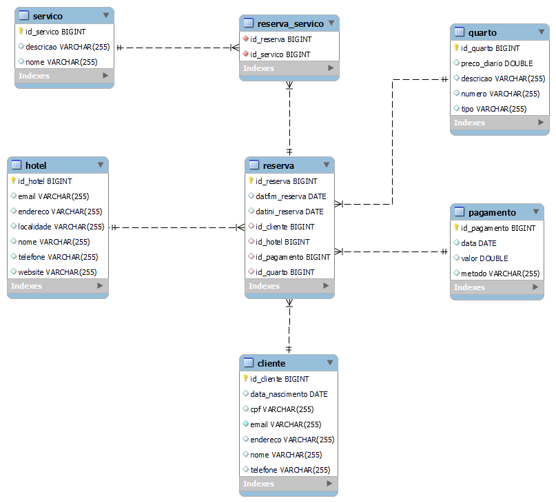

# Sistema de Gerenciamento de Hotel

## Descrição

Este projeto é um sistema de gerenciamento de hotel que permite realizar operações de CRUD em um banco de dados, gerenciando informações sobre clientes, hotéis, quartos, reservas, pagamentos e serviços.
O sistema é seguro e exige autenticação para a maioria das operações.

Desenvolvido durante a disciplina de Programação WEB II - FURB 2024/01

## Funcionalidades

- CRUD completo para as tabelas:
  - Clientes
  - Hotéis
  - Quartos
  - Reservas
  - Pagamentos
  - Serviços
- Relacionamentos muitos-para-muitos entre reservas e serviços.
- Autenticação usando JWT.
- Documentação da API utilizando Swagger.

## Tecnologias Utilizadas

- **Linguagem**: Java
- **Framework**: Spring Boot
- **Autenticação**: JWT
- **Documentação**: Swagger
- **Banco de Dados**: MySQL

## Modelo de Dados

## Licença
Distribuído sob a licença MIT.
